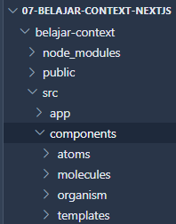
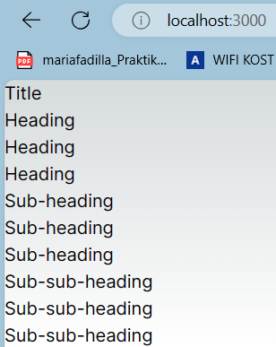
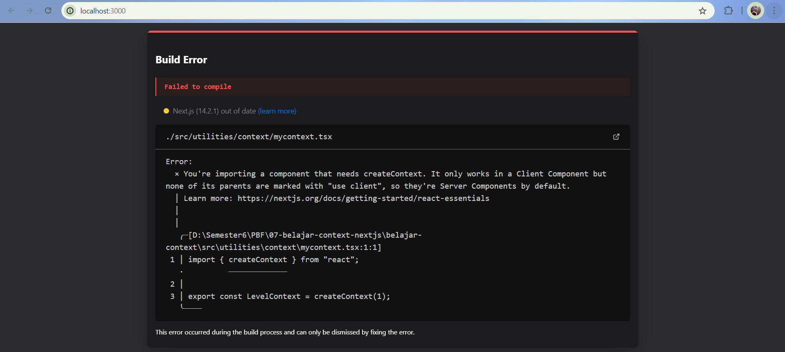
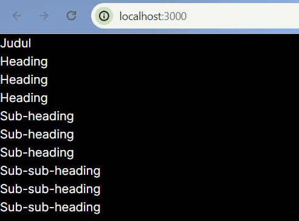
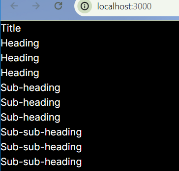

# **Laporan Praktikum - #07 Context**

|  | Pemrograman Berbasis Framework 2024 |
|--|--|
| NIM |  2141720063|
| Nama |  Maria Fadilla |
| Kelas | TI - 3A |

<br>

## **Praktikum 1: Membuat Variasi Ukuran Teks Heading dengan Context**
---

### **Membuat stuktur folder dengan prinsip [atomic design](https://bradfrost.com/blog/post/atomic-web-design)**

Membuat folder baru di src/components seperti berikut ini:



### **Membuat Komponen Atom Baru** 

Membuat file baru di `src/components/atoms/heading.tsx` berisi kode sebagai berikut:

```bash
export default function Heading({ level, children }: { level: number; children: any }) {
    switch (level) {
        case 1:
            return <h1>{children}</h1>;
        case 2:
            return <h2>{children}</h2>;
        case 3:
            return <h3>{children}</h3>;
        case 4:
            return <h4>{children}</h4>;
        case 5:
            return <h5>{children}</h5>;
        case 6:
            return <h6>{children}</h6>;
        default:
            throw Error('Unknown level: ' + level);
    }
}
```

Kemudian membuat file baru di `src\components\atoms\section.tsx` berisi kode berikut:

```bash
export default function Section({ children }: { children: any }) {
    return (
        <section className="section">
            {children}
        </section>
    );
}
```

Lalu pada bagian `MainPage` buat file baru di `src\components\templates\main_page.tsx` berisi kode sebagai berikut:

```bash
import Heading from "../atoms/heading";
import Section from "../atoms/section";

export default function MainPage() {
    return (
        <Section>
            <Heading level={1}>Title</Heading>
            <Section>
                <Heading level={2}>Heading</Heading>
                <Heading level={2}>Heading</Heading>
                <Heading level={2}>Heading</Heading>
                <Section>
                    <Heading level={3}>Sub-heading</Heading>
                    <Heading level={3}>Sub-heading</Heading>
                    <Heading level={3}>Sub-heading</Heading>
                    <Section>
                        <Heading level={4}>Sub-sub-heading</Heading>
                        <Heading level={4}>Sub-sub-heading</Heading>
                        <Heading level={4}>Sub-sub-heading</Heading>
                    </Section>
                </Section>
            </Section>
        </Section>
    );
}
```

Perhatikan komponen Heading tersebut yang menerima level untuk ukurannya.

### **Mengubah isi kode `page.tsx` dan run**

Mengubah kode di `src\app\page.tsx` seperti berikut:

```bash
import MainPage from "@/components/templates/main_page";

export default function Home() {
  return <MainPage />;
}
```

Lalu run dan lihat hasilnya di browser.



### **Jawaban Soal 1**

Jelaskan apa yang telah Anda pelajari dan bagaimana tampilannya saat ini?

- Dalam praktikum ini, saya belajar tentang penggunaan context dalam React untuk menyediakan data ke komponen-komponen child. Saya juga mempraktikkan pembuatan struktur folder berdasarkan prinsip atomic design dan pembuatan komponen atom dengan variasi ukuran teks heading.

- Pada hasil running di atas, dapat dilihat bahwa tampilan saat ini menunjukkan hierarki heading yang berbeda-beda ukurannya, mulai dari level 1 hingga level 4, sesuai dengan data level yang diberikan ke komponen Heading.

### **Membuat Context**

Membuat file baru di `src\utilities\context\mycontext.tsx` yang berisi kode sebagai berikut:

```bash
import MainPage from "@/components/templates/main_page";

export default function Home() {
    return <MainPage />;
}
```

Satu-satunya argumen untuk createContext adalah nilai default. Disini, 1 merujuk pada level heading terbesar, tapi Anda dapat mengoper nilai apa pun (bahkan sebuah objek). Anda akan melihat pentingnya nilai default di langkah selanjutnya.

### **Menggunakan Context**

Mengubah isi kode komponen `Heading` dengan Impor `useContext` Hook dari React dan context Anda:

```bash
import { LevelContext } from "@/utilities/context/mycontext";
import { useContext } from "react";
```

Saat ini, komponen `Heading` membaca `level` dari props. Sebagai gantinya, hapus prop `level ` dan baca nilai dari context yang baru saja Anda impor, `LevelContext`:

```bash
export default function Heading({ children }: { children: any }) {
    const level = useContext(LevelContext);
    switch (level) {
        case 1:
            return <h1>{children}</h1>;
```

useContext adalah sebuah Hook. Sama seperti useState dan useReducer, Anda hanya dapat memanggil sebuah Hook secara langsung di dalam komponen React (bukan di dalam pengulangan atau pengkondisian). useContext memberitahu React bahwa komponen Heading mau membaca LevelContext.

Sekarang komponen Heading tidak membutuhkan sebuah prop level, Anda tidak perlu mengoper level prop ke Heading di JSX Anda. Sebagai gantinya Perbarui JSX sehingga Section yang dapat menerimanya:

```
export default function MainPage() {
    return (
        <Section level={1}>
            <Heading>Judul</Heading>
            <Section level={2}>
                <Heading>Heading</Heading>
                <Heading>Heading</Heading>
                <Heading>Heading</Heading>
                <Section level={3}>
                    <Heading>Sub-heading</Heading>
                    <Heading>Sub-heading</Heading>
                    <Heading>Sub-heading</Heading>
                    <Section level={4}>
                        <Heading>Sub-sub-heading</Heading>
                        <Heading>Sub-sub-heading</Heading>
                        <Heading>Sub-sub-heading</Heading>
                    </Section>
                </Section>
            </Section>
        </Section>
    );
}
```

### **Menyediakan context**

Komponen Section saat ini merenders anaknya, bungkus mereka semua dengan sebuah context provider untuk menyediakan LevelContext kepada mereka seperti kode berikut:

```bash
import { LevelContext } from "@/utilities/context/mycontext";

export default function Section({ level, children }: { level: number, children: any }) {
    return (
        <section className={`section`}>
            <LevelContext.Provider value={level}>
                {children}
            </LevelContext.Provider>
        </section>
    );
}
```

Ini memberitahu React: "jika ada komponen di dalam < Section > ini yang meminta LevelContext, berikan level ini." Komponen akan menggunakan nilai dari < LevelContext.Provider > terdekat di pohon UI (tree) di atasnya.

### **Jawaban Soal 2**

Hasil run: 



- Masih terdapat eror, dimana komponen yang diimpor membutuhkan `createContext` yang hanya bekerja pada `komponen klien`, namun belum ada parents yang menggunakan `use client`, sehingga dianggap komponen server secara default. Oleh karena itu, perlu ditambahkan `'use client';` pada file yang mengimpor komponen tersebut. Berikut perbaikan kode pada file `src/app/page.tsx`:

```bash
'use client';

import MainPage from "@/components/templates/main_page";

export default function Home() {
  return <MainPage />;
}
```
Dan berikut tampilannya saat kodenya sudah diperbaiki: 



Tampilannya sama seperti sebelumnya, menampilkan hierarki dari Heading text.

- `useContext` ialah sebuah `Hook`. Seperti halnya `useState` dan `useReducer`, hanya dapat memanggil sebuah Hook secara langsung di dalam komponen React (bukan di dalam pengulangan atau pengkondisian). `useContext` memberitahu React bahwa komponen `Heading` mau membaca `LevelContext`.

### **Menggunakan dan menyediakan context dari komponen yang sama**

Saat ini, masih harus menentukan setiap `level section` secara manual, karena context memungkinan membaca informasi dari komponen di atasnya, setiap `Section` dapat membaca level dari Section di atasnya, dan mengoper `level + 1` ke bawah secara otomatis. Berikut adalah bagaimana dapat melakukannya dengan mengubah sedikit kode pada komponen `Section`:

```bash
export default function Section({ children }: { children: any }) {
    const level = useContext(LevelContext);
    return (
        <section className={`section`}>
            <LevelContext.Provider value={level}>
                {children}
            </LevelContext.Provider>
        </section>
    );
}
```

Dengan perubahan ini, Anda tidak perlu mengoper prop level baik ke `< Section >` atau ke `< Heading >`: 

```bash
export default function MainPage() {
    return (
        <Section>
            <Heading>Title</Heading>
            <Section>
                <Heading>Heading</Heading>
                <Heading>Heading</Heading>
                <Heading>Heading</Heading>
                <Section>
                    <Heading>Sub-heading</Heading>
                    <Heading>Sub-heading</Heading>
                    <Heading>Sub-heading</Heading>
                    <Section>
                        <Heading>Sub-sub-heading</Heading>
                        <Heading>Sub-sub-heading</Heading>
                        <Heading>Sub-sub-heading</Heading>
                    </Section>
                </Section>
            </Section>
        </Section>
    );
}
```

```bash
export default function Heading({ children }: { children: any }) {
    const level = useContext(LevelContext);
    switch (level) {
        case 0:
            throw Error('Heading must be inside a Section!');
        case 1:
            return <h1>{children}</h1>;
        case 2:
            return <h2>{children}</h2>;
        case 3:
            return <h3>{children}</h3>;
        case 4:
            return <h4>{children}</h4>;
        case 5:
            return <h5>{children}</h5>;
        case 6:
            return <h6>{children}</h6>;
        default:
            throw Error('Unknown level: ' + level);
    }
}
```

Sekarang keduanya `Heading` dan `Section` membaca `LevelContext` untuk mencari tahu seberapa "dalam" mereka. Dan `Section` membungkus anaknya ke dalam `LevelContext` untuk menentukan bahwa apa pun yang ada di dalamnya berada pada level yang "lebih dalam".

### **Jawaban Soal 3**

Hasil run: 



- Menggunakan `useContext` untuk `Membaca Context`.

- Menggunakan `Context` untuk Menentukan `Ukuran Heading`. Section menerima children dan menambahkan 1 ke level sebelumnya. Dengan demikian, semua Heading yang berada di dalam Section akan memiliki ukuran yang lebih besar dari Heading yang berada di luar Section.

- Tampilannya masih sama dengan yang sebelumnya. 